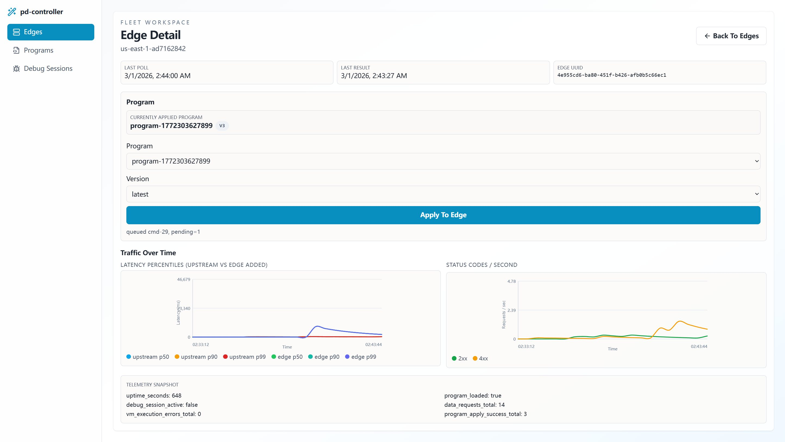
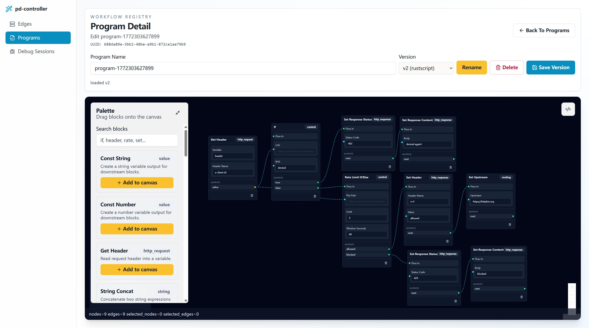
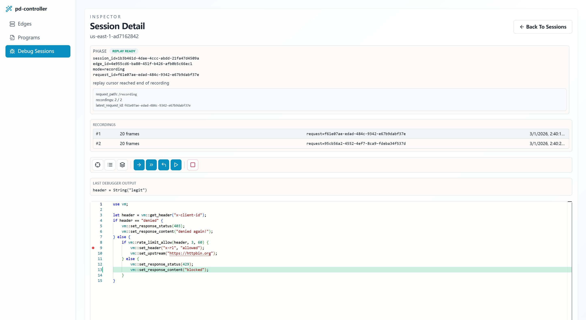

# pd-controller

`pd-controller` is the control-plane server for `pd-edge` data planes.

It implements:

- edge RPC pull endpoint: `POST /rpc/v1/edge/poll`
- edge RPC result callback: `POST /rpc/v1/edge/result`
- admin endpoints to enqueue commands per edge (`apply_program`, `start_debug_session`, `stop_debug_session`, `get_health`, `get_metrics`, `get_telemetry`, `ping`)
- edge status/result query endpoints
- `GET /healthz` and `GET /metrics`
- embedded WebUI static serving on `/ui` and `/ui/*`


### Edge overview



### Program management



### Debugger




## Run

```powershell
cargo run -p pd-controller
```

## Docker image

Release workflow publishes `fffonion/pd-controller:<tag>` and `fffonion/pd-controller:latest`.

Run controller with published image:

```powershell
docker run --rm -p 9100:9100 fffonion/pd-controller:latest
```

Version metadata:

```powershell
cargo run -p pd-controller -- --version
```

If WebUI assets were built before compile, the controller serves them from:

- `http://127.0.0.1:9100/ui`

To embed fresh assets into the binary locally:

```powershell
cd pd-controller/webui
bun install
bun run build
cd ../..
cargo run -p pd-controller
```

`bun run build` now also builds the browser wasm linter (`pd-vm-lint-wasm`) and copies:

- `pd-controller/webui/public/wasm/pd_vm_lint_wasm.wasm`

The controller serves this file under `/ui/wasm/pd_vm_lint_wasm.wasm` for Monaco live linting in code edit mode.

Env vars:

- `CONTROLLER_ADDR` (default `0.0.0.0:9100`)
- `CONTROLLER_DEFAULT_POLL_MS` (default `1000`)
- `CONTROLLER_MAX_RESULT_HISTORY` (default `200`)
- `CONTROLLER_STATE_PATH` (default `.pd-controller/state.json`; set to empty string to disable persistence)

Persistence files (when `CONTROLLER_STATE_PATH` is set) are split as:

- core state: `<state_path>` (edge core status + sequences)
- programs: `<state_stem>.programs.json`
- time series: `<state_stem>.timeseries.bin` (compact binary payload, smaller than JSON)
- debug recordings: `<state_stem>.recordings.json`
- debug sessions: `<state_stem>.debug-sessions.json`

## Example: enqueue bytecode for edge `edge-1`

```powershell
curl -X PUT "http://127.0.0.1:9100/v1/edges/edge-1/program" `
  -H "content-type: application/octet-stream" `
  --data-binary "@example.vmbc"
```

## End-to-end integration test

Run the demo integration test that boots `pd-controller` + `pd-edge`, enqueues a program, and verifies edge behavior:

```powershell
cargo test -p pd-controller e2e_controller_can_push_program_to_active_proxy_edge
```

## WebUI

WebUI source lives at `pd-controller/webui` (React + shadcn components).

1. Start controller:

```powershell
cargo run -p pd-controller
```

2. Start WebUI dev server:

```powershell
cd pd-controller/webui
bun install
bun run dev
```

By default, Vite proxies `/v1` API calls to `http://127.0.0.1:9100`.
You can override with `VITE_CONTROLLER_URL`.

UI-focused APIs exposed by controller:

- `GET /v1/ui/blocks` (block catalog)
- `POST /v1/ui/render` (render 4 source flavors from block graph)
- `POST /v1/ui/deploy` (compile selected flavor to bytecode and enqueue `apply_program`)

`/v1/ui/render` and `/v1/ui/deploy` accept either:

- legacy linear payload: `{"blocks":[{"block_id":"...","values":{...}}]}`
- graph payload:
  `{"nodes":[{"id":"n1","block_id":"...","values":{...}}],"edges":[{"source":"n1","source_output":"value","target":"n2","target_input":"value"}]}`

### Debug sessions in WebUI

`/ui` debug sessions now support two modes:

- `interactive`: existing live edge debugger attach mode (header-triggered).
- `recording`: collects one or more full VM execution recordings for a target request path, then replays locally in controller UI.

For recording mode in UI:

1. Select `Mode = Recording`.
2. Set `Request Path` (for example `/api/orders`) and `Record Count` (default `1`).
3. Start session and send matching requests to the edge.
4. Open captured recordings from the recordings sub-list in session detail.
5. Use the same Monaco view + toolbar commands (`where/step/next/continue/out/locals/stack/print`) during replay, including hover variable inspection.
